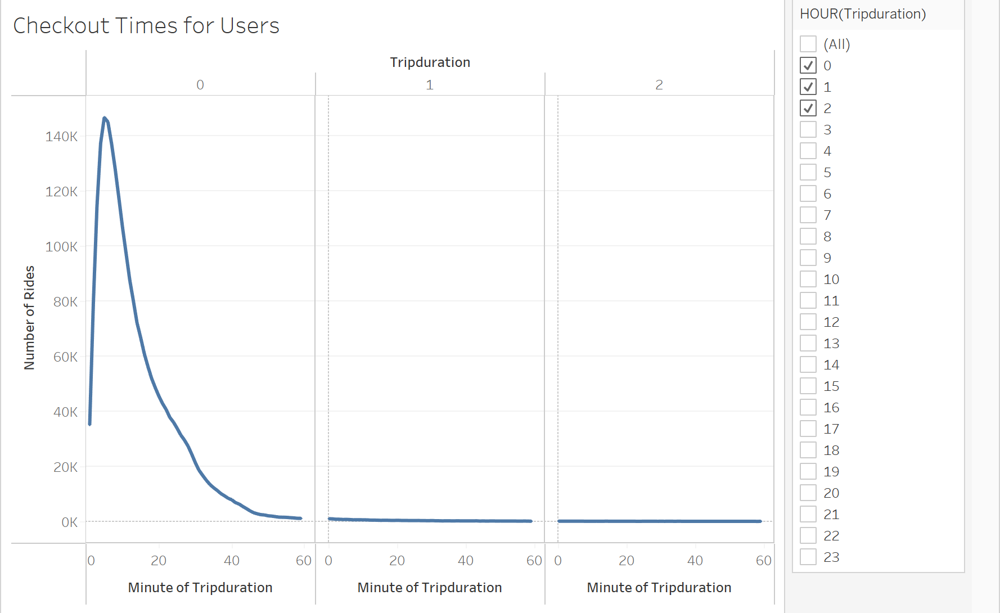

# bikesharing
 Create visualizations using Tableau.

# Overview: 

A business adventurer wants to start a bike-sharing business in Des Moines that similar to a bike-sharing service in NYC. The task for this project is to prepare a business proposal for a bike-sharing company for an investor. For analysis, I'll be using the NYC Citi Bike data that has been released to the public. To transform data into an engaging story and display data in a professional way, I'll be using Tableau to create and style worksheets, dashboards, and stories.  

# Results:

    1. 
    

    There was 2,344,244 riders in the month of August.

    2.  
    

    There was 4X more subscribed customers than short-term customers

    3. 
    

    There was 2.6X more male riders than female riders.

    4. 
    

    There were more male subscribed riders than female riders.

    5. 
    

    The peak hours were between 5pm and 7 pm.

    6. 
    

    There were more male riders every day of the week.

    7. 
    

    The longest checkout time overall was 5 minutes.

    8. 
    
     

    The longest checkout time for male was 6 minutes.  The longest checkout time for female was 5 minutes

# Summary:
    - There were significantly more male riders than female riders.
    - The longest length of time that bikes are checked out were about 5 minutes.
    - The number of bike trips, for all riders and genders for each hour of each day of the week, were highest in early evening 5-7 pm same time every weekday.
    - The number of bike trips, for each type of user and gender for each day of the week, were higher in subscribed riders than short-term riders.  

Two additional visualizations that I would like to see are:

    1. Which type of bike is preferred by Males vs. Female riders?

    2. Which day of the week and which hour of the day is preferred by which age group?

[link to dashboard]
https://public.tableau.com/app/profile/janet.tran/viz/Bikesharing_16572525527380/Story1
